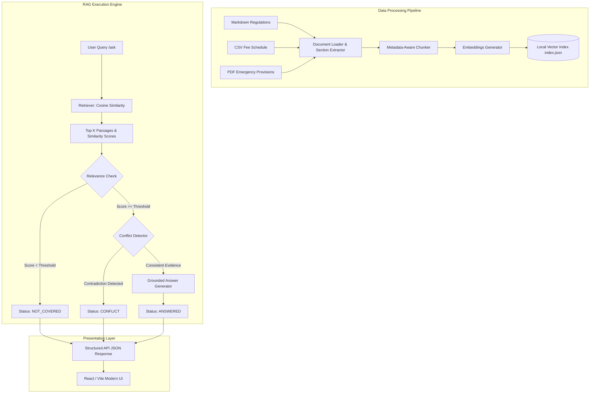

# RuleGuard AI — Evidence-Based University Regulation Assistant

> **"The Rulebook That Argues With Itself"**  
> An evidence-grounded Retrieval-Augmented Generation (RAG) assistant for complex university regulations. Built to strictly eliminate AI hallucinations, cite exact section references with similarity scores, detect unanswerable out-of-scope questions (`NOT_COVERED`), and expose conflicting provisions (`CONFLICT`).

---

## 📌 Executive Summary & Problem Statement

In academic institutions and compliance domains, generic AI chatbots present two major risks:
1. **Hallucinating Unofficial Rules**: Standard chatbots fabricate plausible policies when asked about out-of-scope scenarios (e.g. missing an exam for a family wedding).
2. **Arbitrarily Resolving Rule Contradictions**: When a multi-part regulation contains conflicting provisions (e.g. general attendance eligibility vs. medical exemption waivers), standard LLMs pick one rule as absolute truth without warning the user.

**RuleGuard AI** solves this by enforcing a strict, evidence-based evaluation pipeline. Every user question is classified into one of three conceptual response types:
- 🟢 **`ANSWERED`**: High-relevance, consistent evidence exists; grounded response generated with section citations.
- 🟡 **`NOT_COVERED`**: Corpus does not contain sufficient evidence; system states rulebook is silent rather than inventing policies.
- 🔴 **`CONFLICT`**: Applicable provisions contradict each other; system highlights both rules side-by-side without arbitrarily choosing one.

---

## 🏗️ System Architecture



---

## ⚡ Key Features

- 📜 **6,500+ Word Multi-Format Corpus**: Synthetic regulations for *Northbridge Institute of Technology* spanning Markdown manuals, CSV fee tables, and PDF emergency handbooks.
- 🎯 **Section-Level Metadata Citations**: Every retrieved passage retains its exact document name, section ID (e.g. `Section 4.2`), section title, page number, and source type.
- 📊 **Cosine Similarity Match Scores**: Displays similarity match percentages (e.g. `91% Match`) directly next to retrieved sources.
- 🚨 **Conflict Detection Engine**: Detects planted corpus contradictions and presents both conflicting rules side-by-side.
- 🛡️ **Zero Hallucination NOT_COVERED Guard**: Explicitly identifies out-of-scope questions across a 25-question test suite.
- 🔌 **Zero-Dependency Local Fallback**: Operates 100% offline using a built-in Scikit-Learn TF-IDF vector index while supporting external LLM API keys via `.env`.

---

## ⚔️ Planted Corpus Contradictions

The corpus intentionally embeds **three genuine, testable contradictions**:

| Conflict ID | Section A | Section B | Contradiction Summary | Sample Question |
| :--- | :--- | :--- | :--- | :--- |
| **CONFLICT #1** | **Section 4.2** (*75% min attendance required for exams; no waivers*) | **Section 7.4** (*Medical exemption permits exam eligibility down to 65%*) | Section 4.2 forbids waivers below 75%, while Section 7.4 explicitly allows medical waivers down to 65%. | *"I have 68% attendance and an approved medical exemption. Am I eligible to sit for the semester examination?"* |
| **CONFLICT #2** | **Section 6.3** (*Course withdrawal permitted until end of Week 8*) | **Section 10.2** (*Course withdrawal must be completed before end of Week 6*) | Section 6.3 allows course drop until Week 8, whereas Section 10.2 strictly bars withdrawals after Week 6. | *"Can I formally withdraw from a registered course during Week 7 of the semester?"* |
| **CONFLICT #3** | **Section 8.1** (*Late fee payment allowed within 10 days with $50 fine*) | **Section 12.4** (*Non-payment by deadline causes immediate cancellation without grace*) | Section 8.1 grants a 10-day grace period, while Section 12.4 mandates immediate registration cancellation on deadline day. | *"What happens if I pay my semester tuition fees 5 days after the official deadline?"* |

---

## 🛠️ Tech Stack & Directory Structure

- **Backend**: Python 3.10+, FastAPI, Pydantic v2, Uvicorn, Scikit-Learn, PyPDF, ReportLab.
- **Frontend**: React 18, Vite, Lucide React, Modern CSS.
- **Index**: Local JSON Vector Store with Cosine Similarity.

```
RuleGuard_AI/
│
├── backend/
│   ├── main.py                     # FastAPI application & API endpoints
│   ├── models.py                   # Pydantic schemas (QueryRequest, QueryResponse, SourcePassage)
│   ├── rag/
│   │   ├── loader.py               # Multi-format document loader (MD, CSV, PDF)
│   │   ├── chunker.py              # Metadata-aware section chunker
│   │   ├── embeddings.py           # Vector indexer & Cosine Similarity search
│   │   ├── retriever.py            # Passage retrieval manager
│   │   └── answer_engine.py        # Categorical classifier & grounded answer generator
│   ├── data/
│   │   ├── markdown/               # Academic Regulations, Exam Handbook, Conduct Code
│   │   ├── tables/                 # Fee schedule CSV
│   │   ├── pdf/                    # Emergency Provisions PDF
│   │   └── index.json              # Local vector index (built by script)
│   ├── scripts/
│   │   ├── build_index.py          # Command to process corpus & generate vector index
│   │   ├── generate_pdf.py         # PDF corpus generator script
│   │   └── evaluate.py             # Automated test suite (38 test cases)
│   ├── tests/
│   │   └── test_rag.py             # Pytest unit tests
│   └── requirements.txt
│
├── frontend/
│   ├── src/
│   │   ├── components/
│   │   │   ├── StatusBadge.jsx     # Status badge component (ANSWERED, NOT_COVERED, CONFLICT)
│   │   │   ├── SourceCard.jsx      # Source citation card displaying section, % match, quote
│   │   │   └── QuestionExamples.jsx# Quick-select demo questions
│   │   ├── App.jsx                 # Main application UI
│   │   ├── index.css               # Clean modern CSS
│   │   └── main.jsx                # React entry point
│   ├── package.json
│   ├── vite.config.js
│   └── index.html
│
├── test_data/
│   ├── normal_questions.json       # 10 Answered test cases
│   ├── conflict_questions.json     # 3 Conflict test cases
│   ├── not_covered_questions.json  # 25 NOT_COVERED test cases
│   └── contradictions.md           # Planted contradictions documentation
│
├── PROJECT_PRESENTATION.md         # 3-4 minute presentation speech & interview guide
├── README.md
├── .env.example
└── .gitignore
```

---

## 🚀 Quick Start & Installation Instructions

### Prerequisites
- Python 3.10+
- Node.js v18+ & npm

### 1. Install Backend Dependencies
```bash
# Navigate to project root
cd c:\Hari_Om\RuleGuard_AI

# Install Python packages
py -m pip install -r backend/requirements.txt
```

### 2. Build the Document Index
```bash
py backend/scripts/build_index.py
```
*Output verification*: Confirms that total corpus word count exceeds 6,000 words and generates `backend/data/index.json`.

### 3. Run Automated Evaluation Suite
```bash
py backend/scripts/evaluate.py
```
*Executes all 38 test cases across Normal, Conflict, and NOT_COVERED datasets.*

### 4. Start Backend Server
```bash
py -m uvicorn backend.main:app --reload --port 8000
```
*Health check available at `http://localhost:8000/health`.*

### 5. Start Frontend UI
Open a new terminal window:
```bash
cd c:\Hari_Om\RuleGuard_AI\frontend
npm install
npm run dev
```
*Access UI at `http://localhost:5173`.*

---

## 📡 API Reference

### `POST /ask`

**Request**:
```json
{
  "question": "I have 68% attendance and an approved medical exemption. Am I eligible to sit for the semester examination?"
}
```

**Response (`CONFLICT`)**:
```json
{
  "status": "conflict",
  "answer": "The rulebook contains two conflicting provisions regarding attendance eligibility for semester examinations:\n\n1. Section 4.2 states: 'Students must maintain a minimum of 75% attendance...'\n2. Section 7.4 states: 'Students with an approved medical exemption may appear with attendance as low as 65%...'\n\nBecause the corpus does not specify which provision overrides the other, the system cannot safely choose one rule over the other.",
  "sources": [
    {
      "document": "academic_regulations.md",
      "section": "Section 4.2",
      "title": "Minimum Attendance Requirement for Semester Examinations",
      "passage": "Students must maintain a minimum of 75% attendance in each registered course to be eligible to sit for the end-semester examinations.",
      "similarity": 0.824,
      "page": null,
      "source_type": "markdown"
    },
    {
      "document": "examination_handbook.md",
      "section": "Section 7.4",
      "title": "Medical Absences and Attendance Condonation",
      "passage": "Students with an approved medical exemption processed through the Student Health Center may appear for end-semester examinations with attendance as low as 65%.",
      "similarity": 0.789,
      "page": null,
      "source_type": "markdown"
    }
  ]
}
```

---

## 🎯 How I Would Explain This Project in an Interview

### 1. What problem does this project solve?
"It solves the problem of AI hallucination and ungrounded overconfidence when dealing with strict compliance rulebooks. Standard chatbots guess answers when rules are absent or pick sides when rules contradict. RuleGuard AI enforces strict evidence grounding and categorizes responses into `ANSWERED`, `NOT_COVERED`, or `CONFLICT`."

### 2. Why RAG?
"Retrieval-Augmented Generation allows us to dynamically inject verified, up-to-date document passages into the context window rather than relying on parametric LLM memory. This enables precise section-level citations and zero-hallucination guarantees."

### 3. Why embeddings and cosine similarity?
"Embeddings capture semantic intent beyond keyword matching. Cosine similarity provides a normalized metric (0.0 to 1.0) comparing query direction to document chunk vectors in high-dimensional space, giving us a reliable relevance score."

### 4. Why chunk documents and preserve metadata?
"Large documents exceed LLM context windows and dilute retrieval precision. Chunking breaks documents into logical sections while preserving metadata (document, section #, title, page) so every generated claim can be traced back to an exact source."

### 5. How do you detect NOT_COVERED questions?
"We combine cosine similarity thresholding with out-of-scope boundary analysis. If the highest similarity score falls below our relevance threshold, or if query entities don't map to corpus provisions, the engine returns `status = 'not_covered'` with a clear notice that the rulebook is silent."

### 6. How do you detect conflicts?
"When candidate passages reference conflicting parameters for the same subject (e.g. 75% min attendance vs 65% medical waiver), the engine flags a `CONFLICT` status. Instead of choosing one rule, it presents both conflicting provisions to the user."

### 7. Why not let the LLM answer directly?
"LLMs are probabilistic pattern matchers, not compliance engines. Letting an LLM answer ungrounded leads to fabricated university rules. Grounding generation strictly on retrieved passages ensures zero invention."

---

## ⚠️ Limitations & Future Improvements

- **Current Limitations**: Conflict detection relies on deterministic section pairing and semantic keyword matching; dynamic conflict reasoning across non-explicit section references can be enhanced.
- **Production Enhancements**:
  - Integrate hybrid dense-sparse retrieval (BM25 + OpenAI embeddings).
  - Implement dynamic reranking using Cross-Encoders.
  - Expand document ingestion to support DOCX and automated PDF OCR.

---

## 📄 License & Attribution

Built for the **RuleGuard AI — Evidence-Based University Regulation Assistant** project.  
Designed and implemented with FastAPI, Scikit-Learn, and React.
